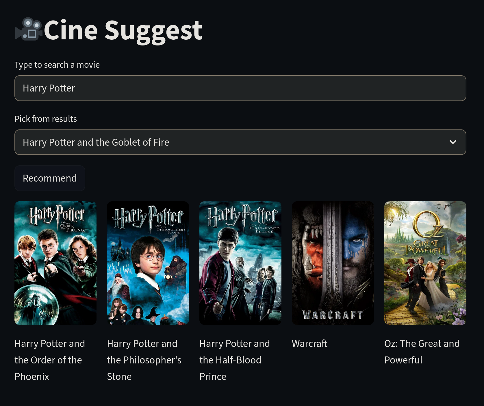

🎬 Cine Suggest — A Smart Movie Recommender

Cine Suggest is a content-based movie recommendation app built using Streamlit and trained on the TMDB Top 5000 Movies dataset. It helps users discover similar movies based on overview, genre, cast, crew, and keywords using NLP and cosine similarity.




🚀 Features

    🔍 Search by movie title

    🎯 Content-based recommendations (overview, genres, cast, director)

    🧠 Cosine similarity with TF-IDF vectorization

    🖼️ Posters fetched live from TMDB API

    📱 Mobile-friendly UI with fuzzy search fallback

## Datasets
### Why TMDB Top 5000 movies data?
- **Balanced Size + Richness:** ~5000 movies, with overview, genres, keywords, release dates, popularity — rich enough for a recommendation engine.
- **Modular Structure:** Split into two cleanly organized files — movies.csv and credits.csv — making merging easy via the shared id field.
- **Complete Metadata:**
    - From movies.csv: title, overview, genres, keywords
    - From credits.csv: movie_id, cast, director, writer, etc. extracted from the JSON-formatted fields
- **Realistic for ML/NLP tasks:** Overview and genre fields are perfect for content-based recommendations.

### Other datasets considered:
- **IMDB Top 1000 movies database:** 1000 movies seemed like a very low number where the original IMDB database contains way more (1000x) data than that.
- **IMDB official Database:** Huge database, (11803648 rows) which itself is a overhead for a project like this. The dataset lacks details like overview, plot etc and requires different datasets to get more info on the casts, crew etc.

## Data Preprocessing Decisions:

- **Lowercased & No Spaces:** Fields like genres, crew, and casts are converted to lowercase and joined by underscores. This prevents token overlap during vectorization. This preprocessing helps increasing the cosine distance between the vectors during vectorization.

    > Example: “Neal Caffery” and “Neal Frankenstine” would both contain the word “Neal” — misleading the model into finding them similar.

- **Result:** Cleaned, deduplicated token space -> improved cosine distance between distinct vectors.

## 🛠️ Tech Stack

    🖥️ Frontend: Streamlit

    🐍 Backend: Python, Pandas, Scikit-learn, Requests

    🎞️ Data: TMDB 5000 Movies Dataset via Kaggle

    🧩 API: TMDB API for fetching live posters

    🚀 Deployment: Streamlit Community Cloud

## 📦 Setup & Run Locally

1. Clone the repo


    ```bash
    git clone https://github.com/yourusername/cinesuggest.git
    cd cine-suggest
    ```

1. Install dependencies

    ```bash
    pip install -r requirements.txt
    ```

1. Set your TMDB API key

    Create a .streamlit/secrets.toml file:
    ```
      TMDB_API_KEY = "your_api_key_here"
    ```

1. Run the app

    ```
    streamlit run app.py
    ```

## 📛 License

This project is licensed under the GNU AGPL v3.0.
You are free to use, modify, and distribute this software, but any derivative work must also be open-sourced under the same license — even if it’s hosted as a web service.

## ✨ Demo & Credits

https://cinesuggest-soumyadghosh.streamlit.app/

Built by Soumyadeep Ghosh as part of a content-based recommendation exploration project.
TMDB data © TMDB and respective contributors.
